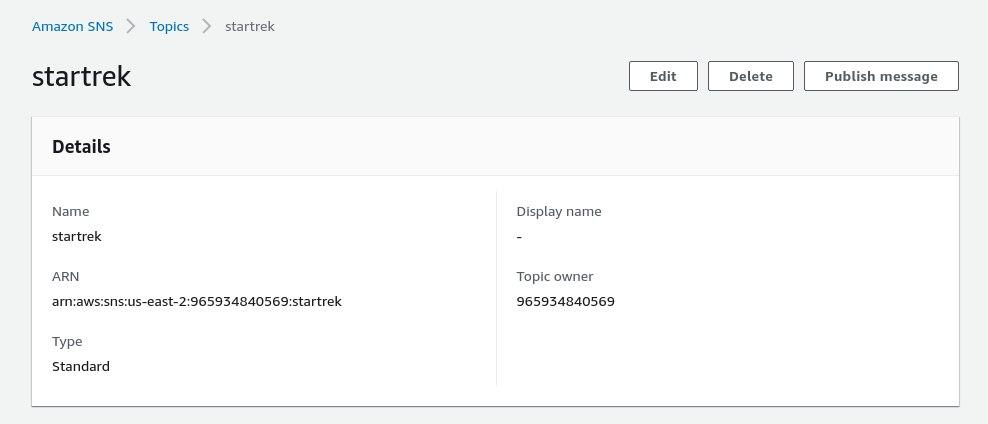
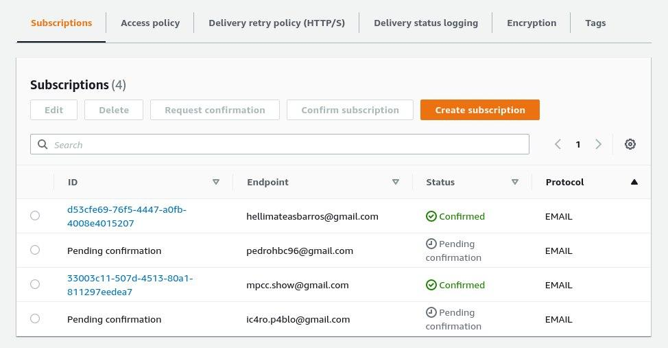

## Deploy da aplicação no AWS

Seguindo as especificações do desafio, o deploy do projeto para o ambiente de produção foi feito atrás do AWS CodePipeline e hospedada no Elastic Beanstalk.

### AWS CodePipeline

O `CodePipeline` é uma ferramenta de CD (continuos delivery) da AWS que permite a automação das etapas de compilação, teste e implantação, permitindo a oferta de atualizações rápidas e confiáveis de aplicativos e infraestruturas. As etapas de
automação utilizadas no projeto foram Source, Build e Deploy.

1. Durante a etapa `Source`, o AWS, através da integração com o GitHub, clona o repositório do projeto que será utilizado posteriormente. A ativação dessa etapa é definida através de triggers. No caso do nosso projeto, o Pipeline é iniciado a cada commit na branch main.

2. Na etapa `Build`, o `AWS CodeBuild` é executado, junto com as etapas de automação definidas no arquivo buildspec.yml. Ao final do processo, o artifact .jar é gerado contendo o projeto compilado e pronto para ser executado.

3. Na etapa final de `Deploy`, o artifact gerado na etapa anterior é enviado ao serviço de hospedagem escolhido.

### AWS Elastic Beanstalk

Após o processo de deploy, o pacote .jar foi enviado para uma instância do `Elastic Beanstalk`, serviço de orquestração da AWS para a implantação de serviços que orquestam vários serviços da AWS, como EC2, CloudWatch, e escalonamento automático.

Alguns componentes foram definidos como o próprio aplicativo a ser executado, a versão de compilação do aplicativo, o ambiente do servidor, e a configuração, que reúne propriedades como conexào com banco de dados e variáveis de ambiente.

Cada versão do aplicativo é salva no `Amazon S3`, e um novo aplicativo é gerado ao final da execução do Pipeline, substuindo a versão anterior.

### AWS SNS

Criamos um `tópico` na AWS para cadastro de emails usando a interface gráfica do `website`. Esse tópico é usado para cadastro de e-mail dos clientes registrados no banco de dados e, claro, para enviar a todos eles mensagens pertinentes sobre suas contas.

Na imagem acima podemos ver os e-mails da equipe cadastrados para teste. Implementamos em nossa `API` enpoints tanto para cadastrar quanto para descadastrar e-mails fazendo uso do `SDK` disponibilizado pela `AWS` como uma dependência do `Maven` (veja o arquivo [`pom.xml`](/project/pom.xml)).

Credenciais de acesso são necessárias, mas elas devem ser definidas em variáveis de ambiente especificadas no [`README.md`](/README.md) por razões de segurança.

Além disso criamos também um endpoint na `API` para envio de mensagens a todos os emails incritos no tópico definido anteriormente.

>_Nota: todos os endpoints mencionados acima podem ser encontrados na [`lista de endpoints do projeto`](endpoint_list.md) para referência rápida_

### API Gateway

Os endpoints da aplicação foram configurados no API Gatewaay, serviço da AWS que serve como uma porta de entrada para acesso de dados, regras de negócio e funcionalidades do back-end.

Com o API Gateway foi possíveel unificar os endpoints da aplicação em um só domínio.
