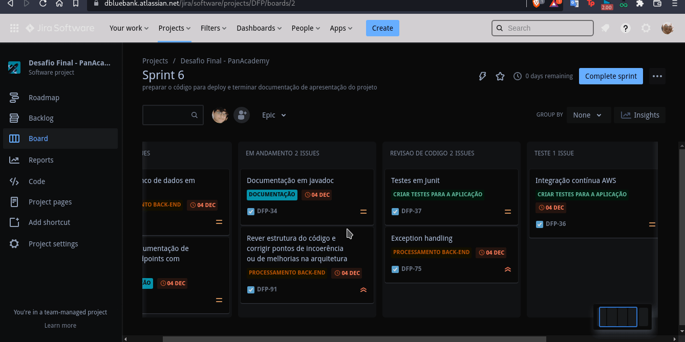

## Gestão e fluxo de trabalho do projeto

Seguindo as recomendações da descrição do desafio optamos por usar a ferramenta `Jira`. Pois assim seria mais fácil gerenciar as tarefas tanto com um quadro Kanban para cada sprint quanto para a elaboração de um backlog consistente e bem definido.

### SCRUM

Adotamos uma versão simplificada do SCRUM, uma metodologia para a gestão de projetos que possuem algum grau de dinamicidade. Essa metodologia consiste basicamente de pequenos avanços revisados e corrigidos ao longo do tempo, onde cada avanço é o que chamamos de `Sprint` e suas revisões e correções ocorrem mediante reuniões entre os membros da equipe.

Nossas reuniões ocorrem diariamente para discutir o andamento das atividades atribuídas aos membros do time, ocorrem também ao fim de cada sprint para avaliar o que foi feito e para planejar a sprint seguinte.

### Backlog e Roadmap

O backlog deve ser entendido como um banco de `tarefas` por assim dizer, essas tarefas basicamente podem ser divididas seguindo uma hierarquia ou `níveis de abstração` do problema a ser resolvido. O nível mais alto e mais abstrato é o `Épico`, ele contém uma descrição genérica do que precisa ser feito e serve de base para a concepção das `Histórias`, que são o segundo nível na hierarquia.

As Histórias já possuem um direcionamento mais claro das ações que devem ser tomadas pela equipe, elas tornam possível a visualização de um objetivo claro e tangível e servem de base para a elaboração de tarefas.

As tarefas são o nível de abstração mais baixo da definição das ações que devem ser tomadas para a resolução do problema, elas descrevem ações simples, diretas e concisas que devem ser feitas de modo a resolver uma pequena parte do problema por vez.

o roadmap que usamos no nosso projeto não foi interamente planejado de modo a obedecer a datas, ele é incrementado automaticamente pela plataforma de gestão que escolhemos,`Jira`, à medida que a conclusão de tarefas de cada épico vai ocorrendo ao longo do tempo.

>_Nota: para visualizar o `roadmap completo` gerado ao fim do projeto abra o arquivo [`/documentation/assets/jira_roadmap.png`](/documentation/assets/jira_roadmap.png)_

### Quadro Kanban

O quadro utilizado pela equipe possui, além das colunas `to-do`, `doing` e `done`, as colunas de `revisão de código` e de `testes`.

As tarefas podem passar ou não pelas colunas de revisão de código e de teste, isso depende da sua natureza e da sua complexidade. Tarefas em revisão de código aguardam uma avaliação conjunta dos membros do grupo sobre a implementação das suas funcionalidades. Tarefas em testes aguardam a verificação das suas funcionalidades em testes práticos.

Cada uma das tarefas, chamadas de `issues` no Jira possui data de entrega; descrição detalhada do que deve ser feito; membro responsável pela sua realização e um nível de prioridade.

>_Nota: por padrão, o Jira permite delegar tarefas a apenas uma pessoa (um assignee), mas alteramos as configurações de card (issue) para que elas pudessem ser delegada a mais de um membro do squad (criamos a propriedade "assignees" que pode conter múltiplos membros)_

>_Nota Nº2: usamos a propriedade de issue "prioridade" disponibilizada pelo próprio Jira, essa propriedade define até 5 níveis de prioridade para cada issue_

Esse quadro é renovado ao começo de cada `Sprint` e pode conter tarefas de mais de um `Épico` por Sprint.

### Fluxo de Trabalho

Optamos por adotar uma solução mais prática em relação ao famoso `Gitflow` e seu modelo de divisão de branches. Nosso projeto consiste em apenas uma única entrega (na qual deverão ser priorizados o aprendizado e a aplicação de conceitos fundamentais) e não em um software para distribuição em massa.

Nosso fluxo de trabalho consiste em criar branches para cada membro do grupo e o escopo de atuação dessas branches varia de acordo com as tarefas assumidas pelos seus respectivos mantenedores ao longo do projeto.

Cada membro, após fazer as modificações necessárias na sua branch, criará um `pull request` para a branch principal que deverá ser revisado e avaliado pelo _"tech lead"_ do grupo. Eventuais conflitos e correções serão discutidos e realizados com toda a equipe.

Com tarefas bem divididas e escopos de atuação bem definidos, garantimos o mínimo de conflito possível nos `merges` com a branch principal.
